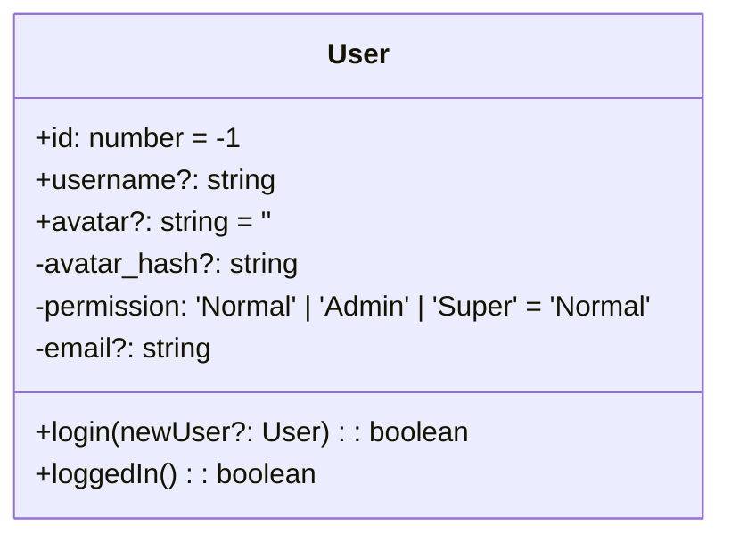
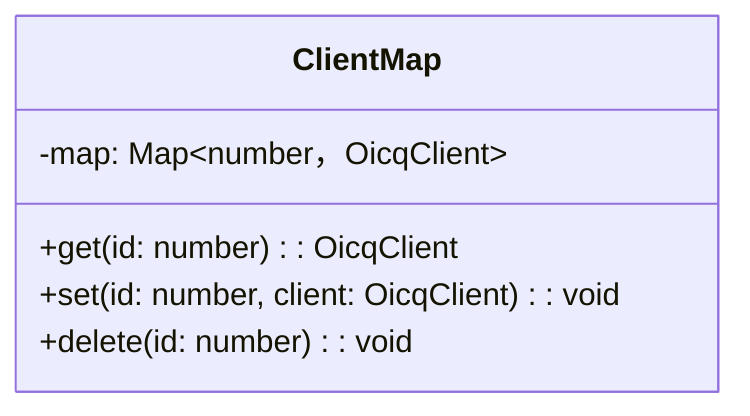

## `class` User

### Overview

```mermaid
classDiagram
  class User {
    +id: number = -1
    +username?: string
    +avatar?: string = ''
    -avatar_hash?: string
    -permission: 'Normal' | 'Admin' | 'Super' = 'Normal'
    -email?: string

    +login(newUser?: User): boolean
    +loggedIn(): boolean
  }
```

## `class` ClientMap

### Overview

```mermaid
classDiagram
  class ClientMap {
    -map: Map~number，OicqClient~
    +get(id: number): OicqClient
    +set(id: number, client: OicqClient): void
    +delete(id: number): void
  }
```
